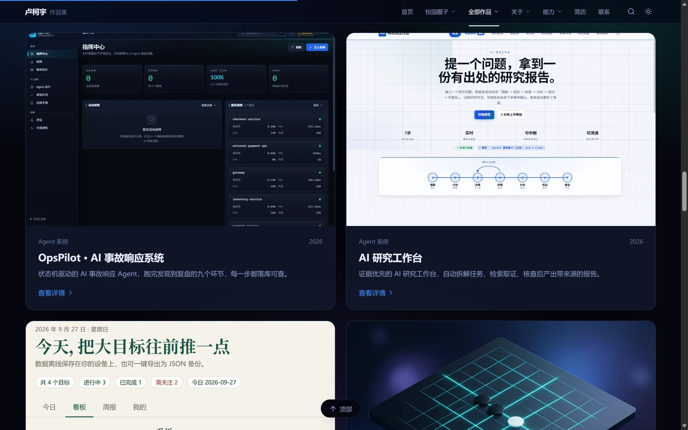

# 个人作品集

卢柯宇的作品集网站。React 19 + Vite 6 单页应用，hash 路由多页面。

<p align="center">
  
  
</p>

深色主题是默认外观，浅色主题共用同一套结构，只覆盖 CSS 变量。

<p align="center">
  
</p>

项目卡片用的是各项目线上站点的真实界面截图。

## 在线地址

- 主站：https://lukeyu-portfolio.app.workbuddy.host/
- 镜像：https://2676136489-png.github.io/personal-design/

两个站部署方式不同，源码相同、构建参数不同，改完各自发布。

## 收录的作品

| 项目 | 方向 | 时间 |
| --- | --- | --- |
| [OpsPilot · AI 事故响应系统](https://opspilot-v2.app.workbuddy.host/) | Agent 系统 | 2026.09 — 2026.10 |
| [AI 研究工作台](https://ebed98754f5b4e4abafe591d754aff06.app.workbuddy.host/) | Agent 系统 | 2026.09 — 2026.10 |
| [校园圈子](https://www.lucky-campus.top) | 全栈 · 校园社交平台 | 2026.05 — 2026.08 |
| Transformer Gomoku 对弈 Bot | 算法系统 | 2026.04 — 2026.06 |
| iGEM Glass Wiki 插件 | Web 组件 | 2026.07 |
| 个人作品集 | 前端开发 | 2026.07 — 2026.08 |
| 学习目标管理台 | Web 应用 | 2026.09 |
| 菜鸟驿站快递管理系统 | 系统设计 | 2024.09 — 2024.12 |
| 校园服务视觉系统 | 品牌视觉 | 探索性设计 |

每个项目都有独立详情页，正文按章节讲设计取舍。

<p align="center">
  
</p>

## 结构

```
index.html
src/
  main.jsx      页面组件、导航与路由分派
  data.js       全部内容数据（项目、能力、时间线、校园圈子详解）
  router.js     hash 路由
  motion.jsx    动效：滚动揭示、视差、数字滚动、逐字上浮
  lightbox.jsx  图片灯箱
  markdown.js   Markdown 渲染
  cloud.js      云服务配置（可选，未配置时走本地分支）
  styles.css    设计系统：变量、双主题、各区块样式
public/media/   图片素材（全部 WebP）
media-src/      截图源图（PNG），不进产物
docs/images/    README 配图
scripts/        构建部署、图片处理、验证脚本
```

## 技术选择

**hash 路由**。站点同时部署在根目录和 `/personal-design/` 子路径下，hash 路由不依赖服务端 rewrite，刷新任意深层页面都不会 404。

**`--base` 只在构建时传参**。主站在根目录、镜像站在子路径，前缀不同，所以不能写死在 `vite.config.js` 里。镜像站的构建由 `scripts/deploy-pages.mjs` 带上 `--base=/personal-design/`。

**导航「按方向」那一列的链接从 `projects` 派生，不手写**。之前七项全写死成 `#/#work`（纯占位），点了只跳到全部作品概览。改成从 `categories` 现算：单个项目的方向直接指到详情页，多个项目的方向落到 `#/category/<slug>` 聚合页摆出全部项目。手写的坏处不只是链接错——往后新增项目改了 `category`，手写的那一列不会跟着变，两边就不一致了。`navItems` 里存的是 getter 而不是数组，因为模块加载时 `projects` 还没定义完，直接绑定拿到的是空数组。

**`public/` 下的图片路径要用 `asset()` 包一层**（`src/data.js` 导出）。Vite 只改写 HTML 和 `import` 的路径，不碰 JS 字符串字面量，所以得自己拼 `import.meta.env.BASE_URL`。写死绝对路径在主站看着正常，到子路径下就整片 404。

**下拉面板挂在 `.global-nav` 上，不挂在触发项里**。`position: absolute` 的定位参照物是最近的定位祖先——挂在触发项里参照物只有几十像素宽，`left: 0; right: 0` 只铺得满那么点；挂在 sticky 的导航栏上，参照物才是整页宽。

**面板开合的命中判定挂在 `<header>` 上**。触发项和面板是兄弟节点，中间隔着导航栏剩下的一圈，指针斜着往下走时会在「导航栏空白 → 面板」之间掉出判定区，来回抖几下就成弹跳。判定挂在 header 上之后，整条移动路径是一个连续命中区。`.nav-panel::before` 再往上顶一条透明命中区作双保险。

**面板本体 `pointer-events: none`，只有内容区 `auto`**。面板铺满整页宽，那条 `::before` 桥梁又往上顶了 28px —— 面板一展开就把整条导航栏盖住，鼠标移过去命中的是面板而不是导航项，于是只能停在第一个展开的面板上。命中判定本来就在 `<header>` 上，不依赖导航项自己收到事件，所以面板整块关掉指针命中不影响开合。

**面板底色用不透明的 `--panel-bg`**。半透明色叠在毛玻璃导航栏上，首屏那行大标题会从面板底下透出来。

**列数由数据传给 CSS 变量**（`--cols`），配 `grid-template-columns: repeat(var(--cols, 3), minmax(0, 1fr))` 等比铺满整行。定死列宽会让 3 列挤在左边、右边空一大片。

**逐字上浮的标题不能靠父级上渐变**。`SplitText` 把每个字拆成带 `transform` 的 `inline-block`，`transform` 会让子元素建立独立层叠上下文，父级的 `background-clip: text` 裁剪不到它们，文字因为继承了 `transparent` 填充色而全部隐形。渐变要施加到 `.split-inner` 自己身上。

**逐字切分时标点要并进前一个字**。每个字是独立的 `inline-block`，换行发生在盒子边界上，浏览器不再套用中文避头尾规则，句号会被甩到下一行单独成行。

**详情页底部留白要盖得住截图的上移量**。`.page-hero-shot` 带 `translateY(34px)` 把首图往上提，这段位移直接吃掉父容器的 `padding-bottom`——按直觉写 48px 的话，实际只剩 14px，按钮和截图几乎贴在一起。这里留 84px，减去位移还剩 50px。断言里写死的是「留白 − 位移 ≥ 36px」这个关系，改任一边都会被拦到。

**「返回首页」是块级 flex，不是 inline-flex**。行内级元素的垂直 margin 不生效，`margin-bottom: 26px` 根本不推动下一行，结果它和下面的分类标签挤在同一行、箭头几乎贴住文字。

**`` 上的 `width` / `height` 是固定像素尺寸提示**，优先级低于 CSS、高于 `auto`。只写 `width: 100%` 而不写高度时，高度会被属性里那个定值顶住，图片纵向变形。所以全局 `img` 规则里显式写了 `height: auto`。

**`overflow: hidden` 只包住图片，不包整张卡片**。精选截图的卡片需要裁切（`data-reveal="img"` 让图片从 1.08 回缩到 1，这期间会超出边框），但 `<figcaption>` 是卡片的子元素——卡片级裁切会把图注文字一起切掉，句子在两侧截断、中间像少了字。改成 `.stage-shot` 单独裁图片，文字留在外面。

主题偏好存在 `localStorage`，key 带版本号（`portfolio-theme-v2`）：整体视觉换过一次之后，旧 key 里存的偏好属于上一套外观，继续沿用会让访客看不到新样式。

## 本地开发

```bash
npm install
npm run dev
```

## 构建与发布

```bash
npm run build          # 产物在 dist/
```

主站以静态服务方式托管 `dist/`，监听 `$PORT`：

```bash
cd dist && python3 -m http.server ${PORT:-3000} --bind 0.0.0.0
```

镜像站：

```bash
node scripts/deploy-pages.mjs
```

脚本重新构建到 `dist-pages/`（带 `--base=/personal-design/`），再强推到 `gh-pages` 分支。主分支只放源码，产物单独走 `gh-pages`，避免几十张截图把仓库撑大。

Pages 首次启用需在仓库 Settings → Pages 里把 Source 设为 `Deploy from a branch`，分支选 `gh-pages`、目录选 `/(root)`。

## 图片处理

截图源图放 `media-src/`（PNG），由 `scripts/optimize-images.py` 统一转成 WebP 写到 `public/media/`，产物里不留 PNG。整站图片从 14.6MB 压到 1.9MB。

README 配图单独一条链路：`scripts/shoot-docs.mjs` 抓线上界面，`scripts/make-docs-images.py` 压成 WebP（`docs/images/`，289KB）。抓的是线上而不是本地构建——README 是给别人看的，展示的应该是访客实际打开的样子。

## 验证

四个 SSR 冒烟脚本。在 Node 侧用 `react-dom/server` 把组件真渲染成 HTML 再断言，不依赖浏览器。

```bash
node scripts/smoke-render.mjs      # 页面渲染、文案、导航、数据结构契约（108 条）
node scripts/smoke-nav.mjs         # 导航下拉：SSR 结构 + 数据 + 样式契约（74 条）
node scripts/smoke-lightbox.mjs    # 图片灯箱结构与交互契约（43 条）
node scripts/smoke-backtotop.mjs   # 回到顶部按钮显隐逻辑（31 条）
```

断言分两种：一种是「内容有没有渲染出来」，另一种是「实现契约有没有被改坏」。后者防的是某次重构悄悄把已经修好的问题带回来——比如「面板底色必须不透明」，改回半透明首屏大标题就会透出来。

还有一层反例验证：

```bash
node scripts/mutation-check.mjs
```

这个脚本把每项修复临时改回坏写法（面板挪回触发项内部、分组设 `position: relative`、竖线删掉……），确认对应的断言真的会 FAIL、退出码非 0，然后还原。不会失败的断言等于没写，所以每加一批断言都要过一遍这个脚本。

布局与交互只能让真实布局引擎回答，比如「指针移进面板会不会又触发 leave」「面板到底铺满整页宽没有」。本机装了 Edge，走 CDP 驱动：

```bash
# 起浏览器与预览服务后
node scripts/cdp-probe.mjs http://127.0.0.1:5199/ 1440 900   # 量布局宽、找溢出元素
node scripts/hover-trace.mjs http://127.0.0.1:5199/          # 真实鼠标走两条路径，数开合翻转次数
node scripts/nav-switch-trace.mjs http://127.0.0.1:5199/       # 连续切换下拉项，看每次是否都弹得出来
node scripts/nav-panel-links.mjs http://127.0.0.1:5199/        # 面板展开后链接还能不能点
node scripts/shot-nav.mjs http://127.0.0.1:5199/ out.png 关于  # 悬停截图 + 量面板几何
node scripts/caption-probe.mjs http://127.0.0.1:5199/         # 扫多个宽度查图注文字有没有被裁
node scripts/shot-captions.mjs http://127.0.0.1:5199/ 9333 1080  # 截图注，用于肉眼确认
node scripts/verify-projects.mjs 5267 9333                    # 逐个详情页量真实几何
node scripts/space-probe.mjs 9333 http://127.0.0.1:5270/  # 量详情页纵向间距，找贴太近的地方
node scripts/about-balance.mjs http://127.0.0.1:5199/ 1440 # 量关于区两列高度差
node scripts/about-link-contrast.mjs http://127.0.0.1:5199/  # 名片链接在两套主题下的对比度
node scripts/shot-about.mjs http://127.0.0.1:5199/ 9333 1440   # 截关于区两列
node scripts/category-nav-trace.mjs http://127.0.0.1:5199/      # 逐条真点「按方向」，验证落点
node scripts/category-guard.mjs http://127.0.0.1:5199/          # 聚合页边界：不存在的 slug、点卡片跳转
node scripts/shot-category.mjs http://127.0.0.1:5199/ 9333 agent 1440  # 截方向聚合页
node scripts/shoot-docs.mjs 9333                              # 抓 README 配图
```

`hover-trace.mjs` 走两条路径：触发项直线移到面板中部，以及在边界附近小幅抖动。真实用户的手不会走直线，抖一下就崩的交互等于不能用。

`verify-projects.mjs` 把每个项目 slug 都打开一遍，确认封面图真的加载了、没被 CSS 拉变形、导航下拉里列得全。静态断言只能证明「数据里有这个 slug」，证明不了图加载了、布局没塌。

`about-link-contrast.mjs` 按 WCAG 公式算前景与背景的亮度比。切主题必须点导航栏那个按钮 —— 主题存在 React state 里，直接改 `data-theme` 属性的话 state 没变，下一次 effect 就把属性写回去，量出来的数据会自相矛盾。

`category-nav-trace.mjs` 走真实鼠标事件点导航下拉里的每一项，读 URL 和落地页标题。SSR 断言只能证明「按这个 hash 渲染的 HTML 里有那个标题」，证明不了真点下去会跳。
